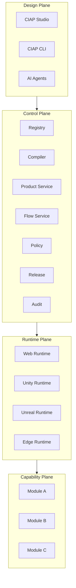
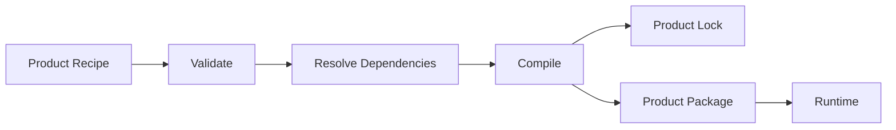

# CIAP-1000 — Architecture Overview

## 1. Purpose

本文档定义 CIAP v1 的总体架构，回答：

1. CIAP 由哪些逻辑层构成；
2. 每一层负责什么；
3. 哪些职责必须分离。

本架构服从 `CIAP-0000`～`CIAP-0004`。

## 2. Architecture goals

CIAP MUST 支持：

- **Composable**：已有 Module 可被不同 Product 复用；
- **Runtime-neutral**：业务语义不绑定 Web / Unity / Unreal；
- **Contract-first**：跨边界协作可机器校验；
- **Deterministic**：Recipe + Lock + Compiler 可重复构建；
- **Governable**：版本、Owner、兼容性和发布可治理；
- **Observable**：关键执行过程可追踪、可审计；
- **AI-compatible**：AI 在规则与权限内参与开发；
- **Incremental**：MVP 不因终局架构而过度复杂。

## 3. Top-level architecture



## 4. Design Plane

### Studio

负责 Product、Flow、Scene、Module 和治理的可视化工作台。

Studio MUST NOT 成为已发布 Product 的运行依赖。

### CLI

CLI 与 Studio 应共享同一套 API、Schema 和 Validation。

核心语义 SHOULD 先能通过 API/CLI 完成，再提供 Studio UI。

### AI Agents

AI 通过标准 API、Schema、Policy 和 Review Workflow 工作。

AI 输出默认是 Draft/Proposal，不是 Source of Truth。

## 5. Control Plane

### Registry

管理 Module、Contract、Flow、Scene、Product、Adapter 和 Asset Metadata。

### Compiler

输入：

```text
Product Recipe
Registry Snapshot
Target Runtime
Compiler Version
```

输出：

```text
Product IR
Product Lock
Flow IR
Scene IR
Runtime Manifest
Asset Manifest
```

### Flow Service

关键业务 Flow 状态 MUST 由服务端持久化。

浏览器、Unity 客户端或 Studio 不得成为关键业务 Flow 的 Source of Truth。

### Policy / Release / Audit

- Policy：是否允许；
- Release：发布什么；
- Audit：发生了什么。

## 6. Runtime Plane

Runtime 负责执行 Product Package。

Runtime Core SHOULD 包含：

```text
Product Host
Module Loader
Adapter Manager
Runtime Context
Scene Runtime
Entity Runtime
Interaction Router
Asset Resolver
Flow Client
Telemetry
```

Runtime MUST NOT 包含某个具体 Product 的 Domain Rule。

## 7. Capability Plane

Module：

- 拥有 Domain State；
- 实现 Capability；
- 发布 Contract；
- 声明 Runtime Support；
- 通过 Adapter 提供具体 Runtime 表现。

Platform Core MUST NOT 吸收产品领域逻辑。

## 8. Build path



Recipe 表达“想要什么”；Lock 表达“最终具体使用什么”。

## 9. Separation rules

### Module vs Flow
Module owns state and domain rules. Flow owns cross-capability process.

### Flow vs Scene
Flow 描述“发生什么”；Scene 描述“如何呈现和交互”。

### Runtime vs Product
Runtime 是通用执行环境；Product 承载产品特定组合。

### Studio vs Runtime
Studio 设计和发布；Runtime 独立执行。

## 10. MVP architecture

MVP SHOULD 优先采用：

```text
TypeScript
Vue 3
Three.js
Node.js
PostgreSQL
Modular Monolith
```

事件第一阶段 MAY 使用 PostgreSQL Outbox + 进程内 Dispatcher。

## 11. Architecture gate

最关键的 PoC：

```text
Warehouse Standard
+
Production Standard
        ↓
reuse
        ↓
Factory Logistics
```

并满足：

> **0 行原 Warehouse / Production Module Domain 源码修改。**

若失败，优先调整 Capability、Contract、Flow 或 Adapter 边界，不继续扩建 Studio / Unity / Marketplace。
