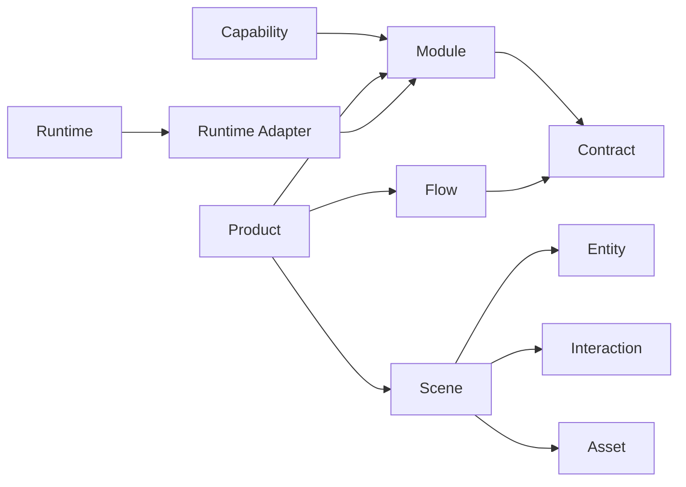
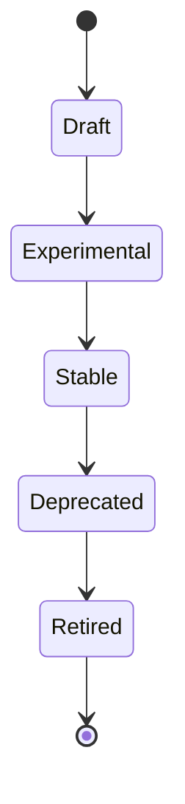
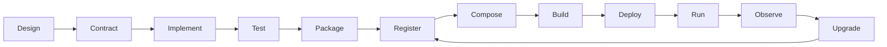

# CIAP-0000 — Meta Model

## 1. Purpose

本文档定义 CIAP 世界中的核心对象、对象关系、身份、所有权、生命周期和不可违反的基础约束。

它回答的不是“如何实现 CIAP”，而是：

> **CIAP 世界里到底存在什么？它们之间是什么关系？**

所有 Architecture、Specification、SDK、Runtime、Studio 和 Compiler 的设计都必须以本 Meta Model 为基础。

---

## 2. Normative language

本文档中的：

- **MUST / 必须**：强制要求；
- **MUST NOT / 禁止**：禁止行为；
- **SHOULD / 应当**：强烈建议，偏离时必须解释原因；
- **MAY / 可以**：可选能力。

---

## 3. Core object model

CIAP v1 的核心对象分为六层。



### 3.1 Business layer

- Capability
- Entity
- Business State

### 3.2 Contract layer

- Action Contract
- Event Contract
- Interaction Contract
- Data Contract
- Permission Contract

### 3.3 Implementation layer

- Module
- Runtime Adapter

### 3.4 Orchestration layer

- Flow

### 3.5 Presentation layer

- Scene
- Projection
- Asset
- Interaction

### 3.6 Product layer

- Product Recipe
- Product Lock
- Product Package
- Runtime

---

## 4. Capability

### Definition

Capability 表示一个稳定、可命名、可拥有的业务能力。

例如：

- 库存管理；
- 库位管理；
- 工单管理；
- 设备控制；
- 质量检验。

### Constraints

1. Capability MUST 有唯一稳定标识 `capabilityId`。
2. Capability MUST 有明确 Owner。
3. Capability SHOULD 对应稳定业务语义，而不是页面或按钮。
4. Capability MUST NOT 以特定 Runtime 命名。
5. Capability MUST NOT 以项目名作为核心语义。

错误：

```text
web-inventory-page
project-a-machine-panel
```

正确：

```text
warehouse.inventory
device.machine
```

---

## 5. Module

### Definition

Module 是 Capability 的一个可发布实现单元。

Module 包含：

- Contract 声明；
- Domain/Application 实现；
- Runtime Support 声明；
- Runtime Adapter；
- Tests；
- Version；
- Owner。

### Constraints

1. Module MUST 拥有自己的业务状态边界。
2. Module MUST NOT 直接访问其他 Module 的私有存储。
3. Module MUST 通过公开 Contract 对外协作。
4. Module MAY 支持多个 Runtime。
5. 一个 Capability MAY 有多个 Module 实现，但必须显式区分实现身份。

---

## 6. Contract

Contract 是 CIAP 中跨边界协作的唯一正式协议。

核心 Contract：

```text
Action
Event
Interaction
Data
Permission
```

### Contract rule

> **所有跨 Module、跨 Runtime、跨 Product 的稳定协作都必须经过 Contract。**

实现细节不是 Contract。

数据库表不是 Contract。

Vue Component 不是 Contract。

Unity GameObject 不是 Contract。

---

## 7. Flow

Flow 描述跨 Capability 的业务过程编排。

Flow SHOULD 引用：

- Action；
- Event；
- Interaction；
- SubFlow。

Flow MUST NOT：

- 引用 Module 私有方法；
- 引用 Vue Component；
- 引用 Unity GameObject；
- 引用 Unreal Actor；
- 嵌入任意 Runtime 专有代码。

因此：

> Flow 是业务过程模型，不是 UI 跳转模型。

---

## 8. Scene

Scene 描述 Product 的可视化世界如何由：

- Layer；
- Slot；
- Entity Projection；
- Asset；
- Interaction；
- Camera Request；

组合形成。

Scene MUST 保持 Runtime-neutral 业务语义。

例如：

```text
focus(machine-001)
```

而不是：

```text
camera.position = ...
```

---

## 9. Product

Product 是可运行软件的组合定义。

Product 由以下对象构成：

```text
Modules
Flows
Scene
Runtime Target
Roles
Configuration
```

### Product rule

Product SHOULD 通过组合已有 Module 构建。

Product MUST NOT 复制已有 Module 的 Domain 实现来形成“产品特供版”。

---

## 10. Runtime

Runtime 是 Product Package 的执行环境。

第一类 Runtime：

- Web
- Unity
- Unreal
- Edge
- Offline

Runtime 负责：

- Product 加载；
- Adapter 生命周期；
- Scene 呈现；
- Entity Projection；
- Interaction 路由；
- Runtime SDK 实现。

Runtime MUST NOT：

- 成为业务 Capability Owner；
- 包含具体 Product 的业务规则；
- 持有业务 Source of Truth。

---

## 11. Runtime Adapter

Runtime Adapter 将 Module 的平台语义映射到具体 Runtime 表现。

示例：

```text
warehouse.inventory
  ├── web adapter
  ├── unity adapter
  └── unreal adapter
```

Adapter MAY：

- 渲染 UI；
- 挂载 Scene Layer；
- 绑定 Entity；
- 响应 Interaction。

Adapter MUST NOT：

- 成为 Domain State Owner；
- 修改 Contract 语义；
- 直接操作其他 Module 私有实现。

---

## 12. Entity

Entity 是跨业务、Scene、Runtime 保持身份一致的对象。

例如：

```text
machine-001
agv-003
warehouse-location-A01
```

Runtime Projection 必须引用 `entityId`，而不是将 Runtime Object ID 作为业务身份。

因此：

```text
machine-001
  ↓
Three.js Object
  ↓
Unity GameObject
  ↓
Unreal Actor
```

三者可以不同，但 `entityId` 保持一致。

---

## 13. Interaction

Interaction 描述用户或操作者与 Product 发生的语义交互。

示例：

- selectMachine
- confirmOutbound
- acknowledgeAlarm
- inspectQuality
- placeMaterial

Interaction 描述“用户在做什么”，而不是“前端用了什么控件”。

---

## 14. Asset

Asset 是 Scene/Runtime 消费的表现资源。

同一逻辑 Asset MAY 有不同 Runtime Variant：

```text
factory.machine-001
  ├── web: glTF
  ├── unity: Prefab
  └── unreal: UAsset
```

Asset MUST NOT 承载业务 Source of Truth。

---

## 15. Ownership model

最低要求：

| Object | Required Owner |
|---|---|
| Capability | Capability Owner |
| Module | Module Owner |
| Contract | Contract Owner |
| Flow | Product/Process Owner |
| Scene | Product/Experience Owner |
| Runtime | Runtime Owner |
| Product | Product Owner |

### Ownership constraint

任何 Stable 公共对象 MUST 有 Owner。

“大家共同维护”不能作为 Owner。

---

## 16. Identity model

核心 ID SHOULD 使用稳定、语义化、可读格式。

示例：

```text
capability: warehouse.inventory
module: warehouse.inventory
action: warehouse.inventory.reserve
event: warehouse.inventory.reserved
flow: factory-logistics.main
scene: factory.main
product: factory-logistics
entity: machine-001
```

ID 与显示名称必须分离。

Display Name 可变。

ID 一旦 Stable SHOULD NOT 随意修改。

---

## 17. Dependency model

允许：

```text
Module → Contract
Flow → Contract
Scene → Entity / Interaction / Asset
Product → Module / Flow / Scene
Adapter → Runtime SDK
```

禁止：

```text
Module → Other Module Private Code
Module → Other Module Private DB
Flow → Runtime-specific Class
Scene → Business Database
Studio → Runtime Internal State
```

---

## 18. Lifecycle

核心生命周期：



对象可以有不同生命周期，但 Stable 对象必须受到兼容性治理。

---

## 19. Build-to-run lifecycle



---

## 20. Meta constraints

CIAP v1 至少遵循以下约束：

1. Product MUST 由 Module / Flow / Scene 组合。
2. Runtime MUST NOT 成为业务 Source of Truth。
3. Module MUST NOT 直接访问其他 Module 私有实现。
4. Flow MUST NOT 包含 Runtime-specific implementation。
5. Scene MUST NOT 成为业务规则容器。
6. Contract MUST 可版本化。
7. Stable Contract 的 Breaking Change MUST 经治理流程。
8. Runtime Adapter MUST 显式声明兼容 Runtime/SDK Version。
9. 一个业务 Entity MUST 使用稳定 entityId。
10. AI Agent MUST 遵守与人类开发者相同的架构约束。

---

## 21. Conformance questions

任何新设计至少回答：

- 它属于哪个 Meta Model Object？
- 它由谁拥有？
- 它的稳定 Identity 是什么？
- 它通过什么 Contract 与外部协作？
- 它是否引入 Runtime-specific 业务语义？
- 它是否复制了已有 Capability？
- 它是否改变了核心对象关系？

若无法回答，设计不得进入 Stable。
