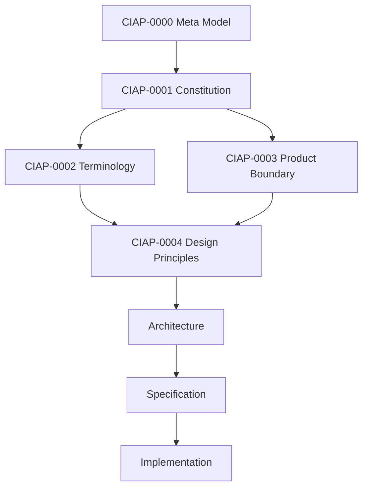

# CIAP Standard

CIAP Standard 是面向可组合 2D/3D 工业软件的平台标准。

当前阶段的核心目标不是增加更多平台能力，而是先冻结：

1. CIAP 世界里有哪些核心对象；
2. 这些对象之间是什么关系；
3. 哪些设计原则不可违反；
4. CIAP 做什么、不做什么；
5. 后续 Architecture / Specification 应如何受到约束。

!!! important
    CIAP-0000～CIAP-0004 是当前仓库最高优先级文档。  
    任何后续架构或实现若与这些文档冲突，应先修改根文档，而不是在实现层“绕过去”。

## 核心关系

